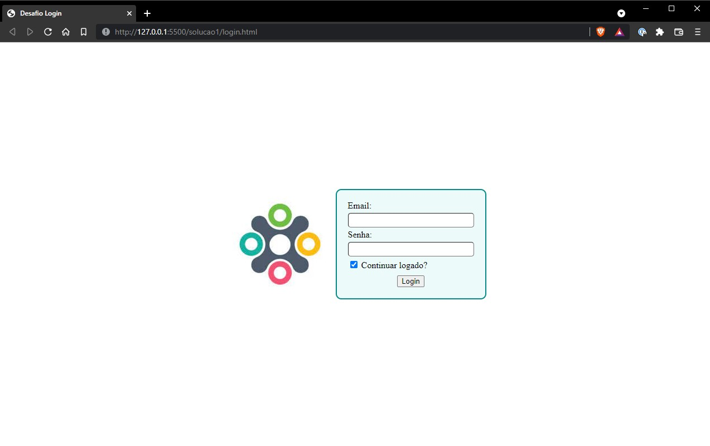
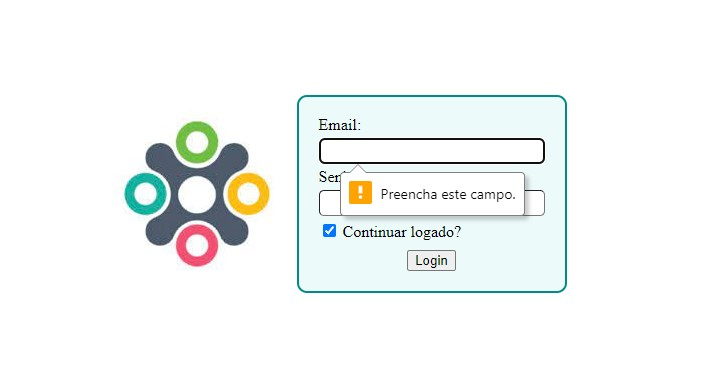
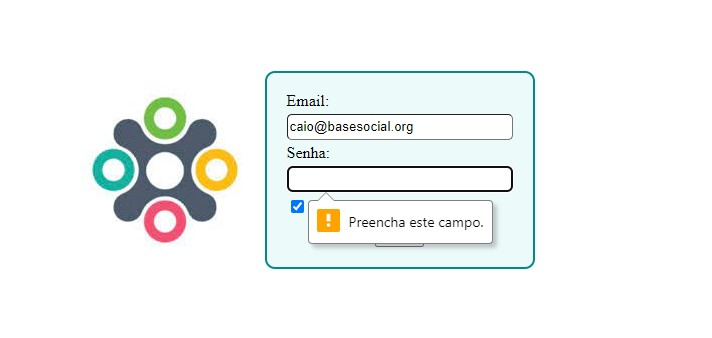
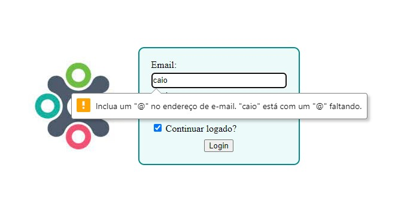
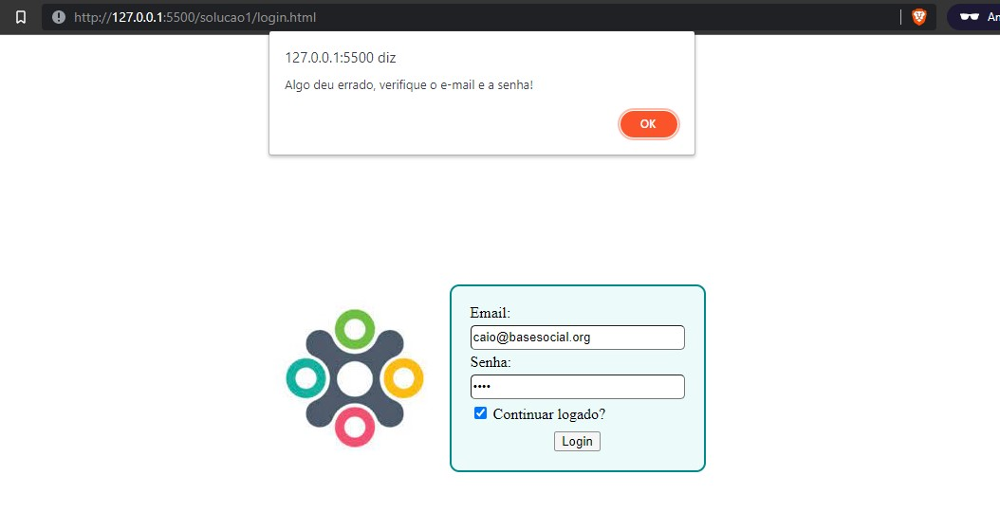
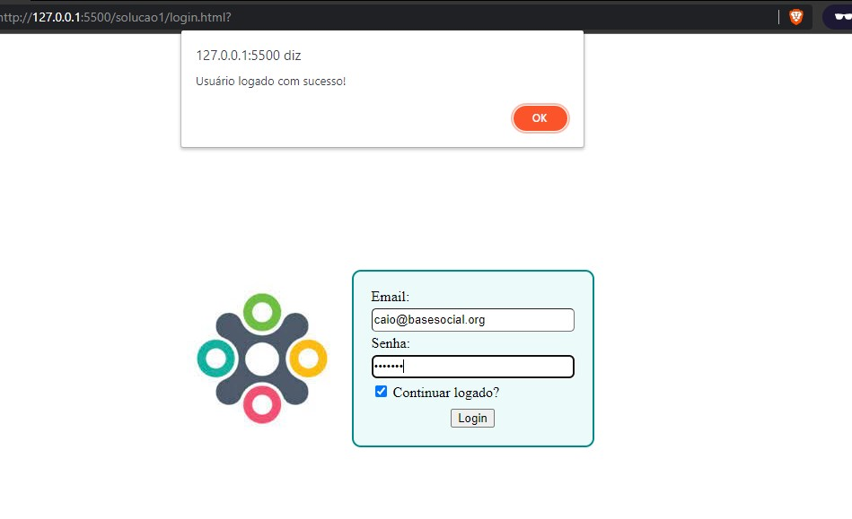

# Desafio: Tela de Login
Para esse desafio utilizaremos `HTML, CSS e Javascript`.
Para o logo da base, utilize a imagem que está nesse projeto, arquivo `logo.jpeg` na pasta `imagens`.

## Resultado visual esperado

## É necessário ter validação nos campos

### O campo email é obrigatório

### O campo senha é obrigatório

### O formato do email precisa estar certo

## Configurem o um email no código para realizar o login
Pode ser através de uma variável ou fixo no código, no meu exemplo eu deixei o email `caio@basesocial.org` e a senha `base123`, quaisquer valores diferentes destes e o login vai dar errado.

### Se o email e a senha estiverem errados

### Se o email e a senha estiverem corretos

