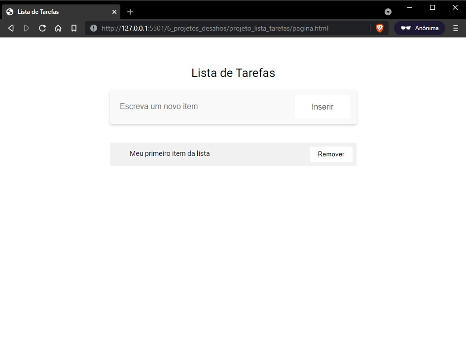

# Projeto - Lista de Tarefas

## Primeira parte
Como início da atividade, foram entregues os arquivos `HTML` e `CSS` necessários para a nossa lista de tarefas.

Acontece que esses arquivos foram propositalmente modificados e estão com diversos problemas.

- 2 erros no `CSS`
- 4 erros no `HTML`

O objetivo da primeira parte é identificar os erros existentes nos arquivos e corrigí-los a fim de deixar a tabela como a imagem abaixo.

## Segunda parte
Uma vez que o `HTML` e o `CSS` estejam corretos, podemos iniciar de fato a nossa lista de tarefas.

O objetivo desta etapa é incluir um ***novo item na lista*** sempre que o botão `inserir` for clicado.

Nessa etapa não nos preocuparemos com o texto dos novos itens, podem ser todos iguais mesmo.

## Terceira parte
Agora precisamos fazer com que o texto que foi adicionado no campo *"Escreva um novo item"* reflita no novo item que foi adicionado ao clicar no botão `Inserir`.

Nessa fase é interessante já implementarmos também a ação do botão `Remover` existente em cada item adicionado na lista.
